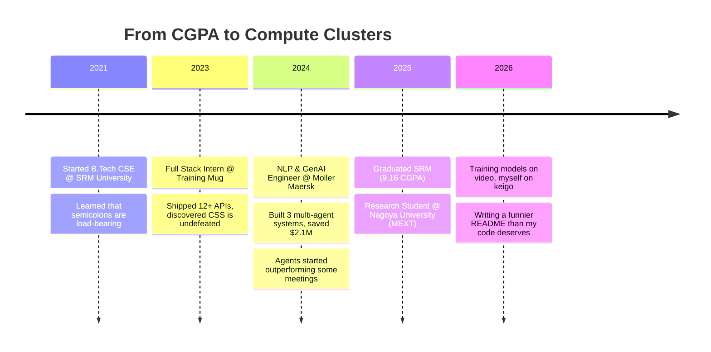

**Research Student @ Nagoya University 🇯🇵 · Ex-NLP/GenAI Engineer @ Moller Maersk 🚢 · Professional Agent Wrangler**

 

## 🧑‍💻 About Me

I'm based in **Bengaluru, India**, but currently living my **Nagoya arc** as a Research Student at Nagoya University under the MEXT Scholarship — which is a fancy way of saying Japan is paying me to stare at videos until machines understand human motion without anyone labeling a single frame.

Before that, I spent a year at **Moller Maersk** as an NLP/GenAI Engineer, where I discovered my actual calling: making AI agents work in teams so I don't have to sit through the meetings myself. Three production multi-agent systems and $2.1M in annual savings later, I've basically become a middle manager for robots.

A few things about me, unranked:

- 📍 **Where:** Bengaluru natively, Nagoya currently
- 🎓 **Doing:** Self-supervised video understanding research, previously enterprise-scale agent orchestration
- 🗣️ **Speaking:** Python fluently, Japanese conversationally (JLPT N3), sarcasm natively
- 🦾 **Actually good at:** Getting multiple LLMs to agree on something — which, if you've tried it, you know is closer to diplomacy than engineering
- 🎥 **Currently:** Teaching models to watch video the way I watch it — without ever labeling anything

> 🎓 Fun fact: I moved from building AI that reads enterprise emails to building AI that watches videos — same energy, better lighting.

 

## 🗺️ The Journey So Far

 

## ⚡ What I Actually Do (No, Really)

- 🔭 Currently designing **self-supervised, multi-scale video understanding frameworks** at Nagoya University — teaching models to understand human motion without a single manual label (my past self, an ex-annotator's nightmare, is proud)
- 🧠 Previously architected **three separate production-grade multi-agent systems** at Maersk — a workflow compiler, an email orchestrator, and an analytics platform — because apparently one AI agent is never enough
- ⚙️ Obsessed with **agentic orchestration**: LangGraph, supervisor-agent hierarchies, reflection loops, and Send-API parallelism (yes, I make my agents fan out and argue with each other — it's called "Multi-Agent Debate" and it's a real term I use in real meetings)
- 📉 Turned "3 hours of manual reporting" into "18 minutes," because analysts deserve lunch breaks
- 🗾 Learning to argue in Japanese (JLPT N3) — my keigo is still catching up to my code quality
- ❓ Ask me about: multi-agent architectures, RAG pipelines that don't hallucinate numbers, or why I think sequential agent pipelines are a personal insult

 

## 🛠️ Current Skillset (Glow-Up Edition)

<table>
<tr>
<td valign="top" width="33%">

### 🤖 Agentic AI & LLM Orchestration

</td>
<td valign="top" width="33%">

### 🧠 ML / DL / NLP

</td>
<td valign="top" width="33%">

### 🔧 Backend, Data & Infra

</td>
</tr>
</table>

🕰️ The "before I discovered agents" era (still valid, mostly for nostalgia)

 

 

## 🏆 Highlight Reel (a.k.a. things I will bring up at a dinner party, unprompted, twice)

| Project | What it does | Why it's cool |
|---|---|---|
| **Workflow Compiler** 🏭 | LangGraph multi-agent system that turns OCR'd process maps into deployable Python apps | Took a 48-hour process down to 20 minutes, then went to production and never called in sick |
| **Enterprise Email Orchestrator** 📧 | Supervisor + debate-agent pipeline (Generator → Critic → Compliance → Final) with episodic/semantic/procedural memory | An AI that argues with itself so your inbox doesn't have to |
| **InsightForge** 📊 | Analytics platform that keeps LLMs away from your actual numbers (deterministic Pandas does the math, LLMs just narrate it) | Zero hallucinated KPIs, 91% retrieval accuracy, analysts get their afternoons back |
| **Video Understanding Framework** 🎥 | Self-supervised, teacher-student distillation model for motion understanding | 4.2x faster, 12x smaller, 0 manual labels harmed in the making |

 

## 🐍 A Snake Eating My Commit History

(Set up in ~2 minutes — see the note at the bottom on how to activate this.)

 

## 📈 GitHub Stats

 

## 📬 Let's Connect

⭐ If my agents ever take over the world, I promise mine will at least send a well-formatted apology email.

 
